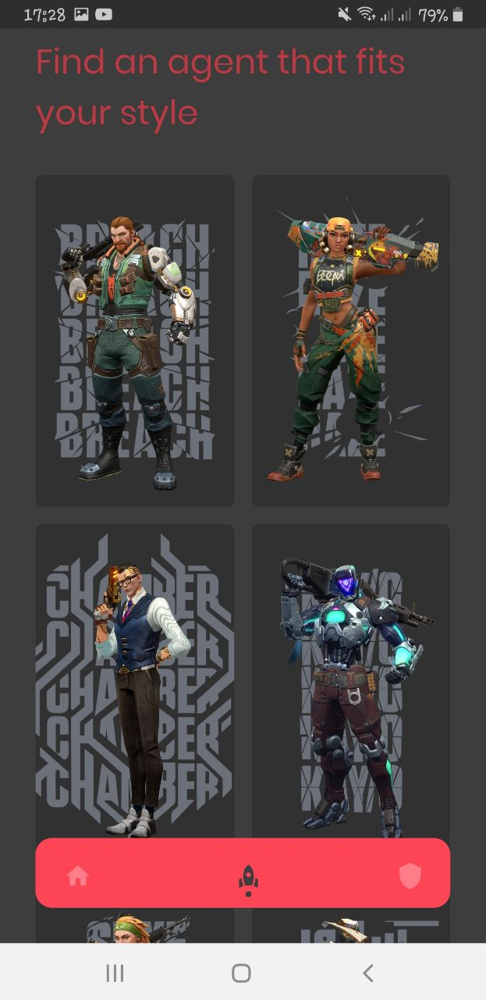
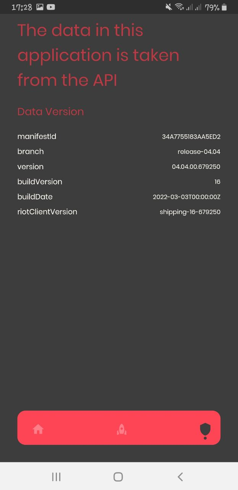
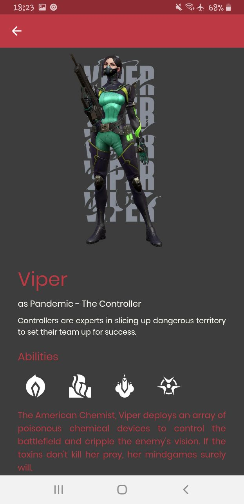

# Flutter Valorant App

Aplikasi Flutter ini berguna untuk mendapatkan data mengenai atau informasi terbaru dari game valorant

- [x] Agent List
- [x] Detail Agent
- [x] New Bundle
- [x] Map List
- [x] API version

<table>
  <tr>
    <td valign="top"> </td>
    <td valign="top"> </td>
    <td valign="top"> </td>
    <td valign="top"> </td>
  </tr>
</table>

API From:
- Valorant Unoffical API => https://valorant-api.com/

## Author
[@ahmoodrzl](https://www.instagram.com/ahmoodrzl/ "Instagram") / Ahmad Rizal Imaduddin

## Getting Started

This project is a starting point for a Flutter application.

A few resources to get you started if this is your first Flutter project:

- [Lab: Write your first Flutter app](https://flutter.dev/docs/get-started/codelab)
- [Cookbook: Useful Flutter samples](https://flutter.dev/docs/cookbook)

For help getting started with Flutter, view our
[online documentation](https://flutter.dev/docs), which offers tutorials,
samples, guidance on mobile development, and a full API reference.
